# 🚀 Projeto de Análise ETL: GitHub + Stack Overflow


Pipeline ETL para análise integrada de atividade de desenvolvimento de software e comunidades técnicas.

---

## 📋 Sumário

- [🌐 Arquitetura do Projeto](#-arquitetura-do-projeto)
- [🛠️ Pré-requisitos](#️-pré-requisitos)
- [⚙️ Configuração](#️-configuração)
- [🚀 Execução](#-execução)
- [📊 Estrutura dos DAGs](#-estrutura-dos-dags)
- [📈 Dashboard e Visualização](#-dashboard-e-visualização)
- [🧪 Testes](#-testes)
- [🔮 Melhorias Futuras](#-melhorias-futuras)
- [🤝 Contribuição](#-contribuição)
- [👥 Equipe](#-equipe)
- [📊 Exemplos de Visualização](#-exemplos-de-visualização)
- [🛠 Troubleshooting](#-troubleshooting)
- [💡 Insights de Negócio](#-insights-de-negócio)

---

## 🌐 Arquitetura do Projeto

```mermaid
graph LR
    A[GitHub API] --> B[Extract]
    C[Stack Overflow API] --> B
    B --> D[Transform]
    D --> E[(PostgreSQL)]
    E --> F[Visualização]
    F --> G[Power BI/Tableau]
```



---

## 🛠️ Pré-requisitos

- Docker 20.10+
- Docker Compose 2.5+
- Contas de desenvolvedor:
  - GitHub Personal Access Token
  - Stack Apps API Key

---

## ⚙️ Configuração

1. Crie um arquivo `.env` na raiz do projeto:

```ini
# Tokens de API
GITHUB_TOKEN=seu_token_aqui
STACKOVERFLOW_KEY=sua_key_aqui

# Configurações do PostgreSQL
POSTGRES_USER=airflow
POSTGRES_PASSWORD=airflow
POSTGRES_DB=etl_project
```

2. Inicie os containers:

```bash
docker-compose up -d --build
```

---

## 🚀 Execução

Acesse a interface do Airflow em: [http://localhost:8080](http://localhost:8080)  
**Credenciais:** `admin / admin`

### DAGs disponíveis:

- `github_popular_repos` – (Semanal)
- `stackoverflow_analysis` – (Diário)
- `github_stack_correlation` – (Semanal)

---

## 📊 Estrutura dos DAGs

### `github_repos_etl.py`

> Extrai repositórios populares por linguagem.  
> Input: GitHub API  
> Métricas: stars, forks, issues  
> Output: Tabela `popular_repos`

### `correlation_etl.py`

> Correlaciona dados GitHub/Stack Overflow.  
> Input: `repo_analysis` + `stackoverflow_questions`  
> Métricas: questions_per_star, commits_per_question  
> Output: Tabela `github_stack_correlation`

---

## 📈 Dashboard e Visualização

Conecte seu Power BI/Tableau ao banco PostgreSQL:

```ini
Server: localhost
Database: etl_project
User: airflow
Password: airflow
```

### Query Exemplo:

```sql
-- Top linguagens por atividade
SELECT language, AVG(activity_score) as avg_activity
FROM repo_analysis
GROUP BY language;
```

---

## 🧪 Testes

### Executando os testes:

```bash
docker exec -it airflow_webserver python -m pytest tests/
```

### Exemplo de teste:

```python
# tests/test_data_quality.py

def test_repo_analysis_schema():
    conn = psycopg2.connect(...)
    df = pd.read_sql("SELECT * FROM repo_analysis LIMIT 1", conn)
    assert {'repository', 'stars', 'language'}.issubset(df.columns)
```

---

## 🔮 Melhorias Futuras

- Adicionar monitoramento com Prometheus
- Implementar alertas para falhas nas APIs
- Adicionar suporte a Elasticsearch

---

## 🤝 Contribuição

1. Faça um fork do projeto  
2. Crie uma nova branch:

```bash
git checkout -b feature/nova-feature
```

3. Commit das alterações:

```bash
git commit -m 'Adiciona nova funcionalidade'
```

4. Push para o repositório:

```bash
git push origin feature/nova-feature
```

5. Abra um **Pull Request**

---

## 👥 Equipe

| Nome     | Função         | Contato                |
|----------|----------------|------------------------|
| Exemplo  | Eng. de Dados  | exemplo@empresa.com    |

---

## 📊 Exemplos de Visualização

> Substitua o caminho abaixo pela imagem do seu dashboard:


---

## 🛠 Troubleshooting

### Erro: "API GitHub retornou 403"

- Verifique se o token tem permissões suficientes
- Confira o rate limit com:

```bash
curl -H "Authorization: token $GITHUB_TOKEN" https://api.github.com/rate_limit
```

---

## 💡 Insights de Negócio

Métricas-chave extraídas do pipeline:

- 📈 **Crescimento semanal de repositórios Python**
- ⏱️ **Tempo médio de resposta no Stack Overflow**
- 🔀 **Correlação entre estrelas no GitHub e volume de dúvidas**

---

> 📅 *Documentação atualizada em {{03/05/25}} por {{Weslley Santana}}*
